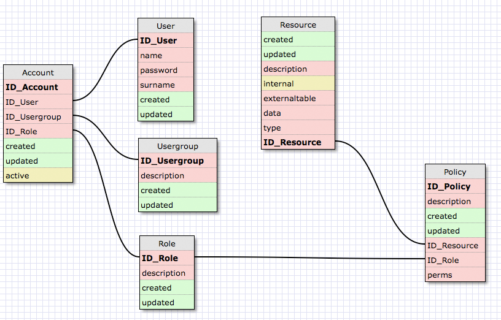

# Shape IAM

Identity Access Management based on [shape-data](https://github.com/kevwe-technology-ab/shape-data)

## features
- Support for relational databases via Jdbc
- Support for Cassandra
- InfluxDb
